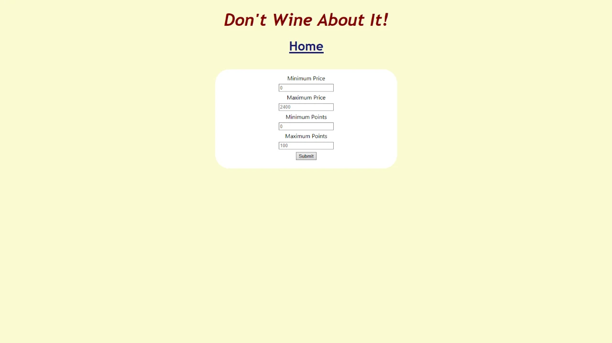

# Lab11-MVC
**Author**: Benjamin Taylor  
**Version**: 1.0.0

## Overview
A ASP.NET MVC application that queries a .csv file for wine information using filters provided the user.

## Getting Started
1. Create a fork of this repository, and clone your fork to your device.
2. Open the solution file `WineApp.sln` in Visual Studio.
3. To run the app, go to `Debug` > `Start Without Debugging` (or press Ctrl+f5).

## Using The Application

1. Upon starting the application, you will see a form in a web browser window (as seen above). Fill out the form and press the submit button to search for wines.
2. After completing the search, a table with the first 100 results will appear in your web browser. To perform another search, press the "Go Back" link above the table or navigate to the previous page using your browser.

## Architecture
**Languages Used**:
* C# 7.3 (ASP.NET Core 2.2)
* HTML
* CSS

Written with Visual Studio Community 2017.
